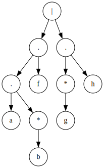
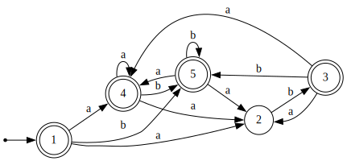
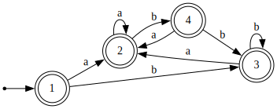

# Lua Regex

[](https://github.com/Gregofi/lua-regex/actions/workflows/test.yaml)

Shows how are Finite State Machines used to implement regular expressions.
Only small subset of regular expressions is supported, namely:
- Concatenation (`ab` -> is implicit)
- Alternation (`a|b`)
- Kleene star (`a*`)
- Kleene plus (`a+`)
- Optional (`a?`)
- Parentheses for grouping (`(ab)`)

## Usage

```bash
make run ast|nfa|dfa '<regex>'
```

which will print a DOT graph of the corresponding tree or automaton.
See examples of generated graphs below.

### Regex abstract syntax tree


### Nondeterministic finite automaton (NFA)


### Deterministic finite automaton (DFA)


Also, you can test a string against a regex:

```bash
make run run '<regex>' '<string>'
```

If the regex matches, exit code will be 0, otherwise it will be 1.

## Implementation

The implementation uses a recursive descent parser to parse the regex into an AST.
Then, the AST is converted to an NFA without epsilon transitions using [Glushkov construction algorithm](https://en.wikipedia.org/wiki/Glushkov%27s_construction_algorithm).
Finally, the NFA is converted to a DFA using the [Powerset construction algorithm](https://en.wikipedia.org/wiki/Powerset_construction).
No minimization is performed on the DFA at the moment.
